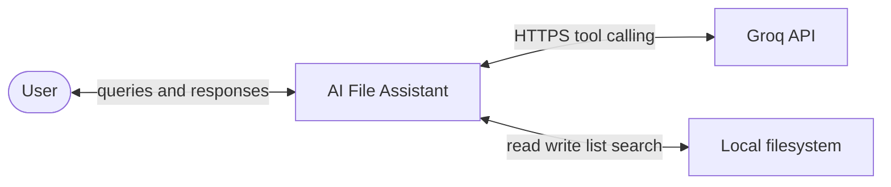
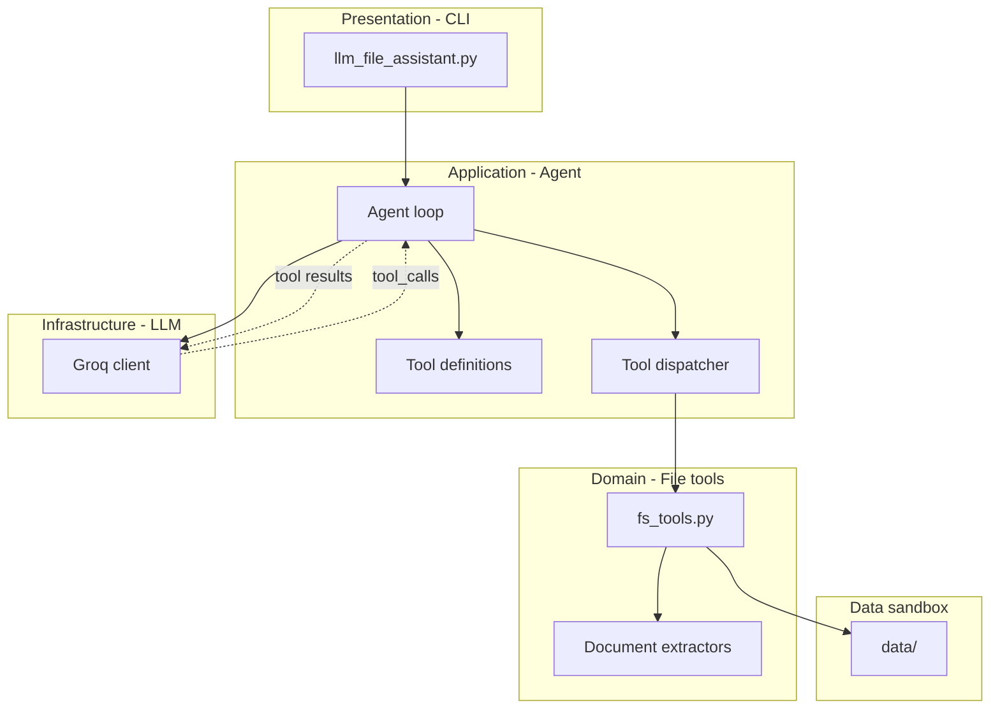
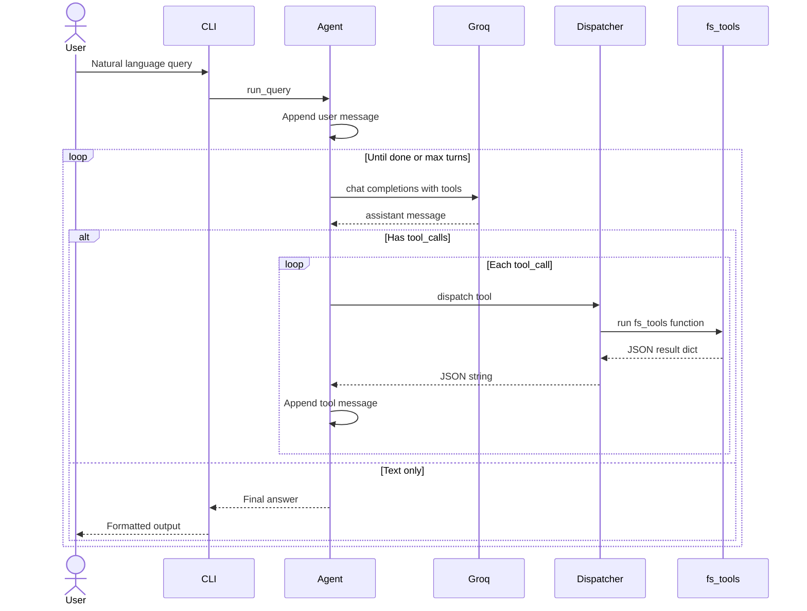
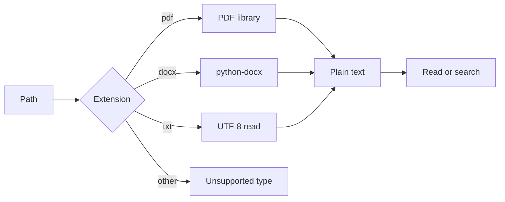
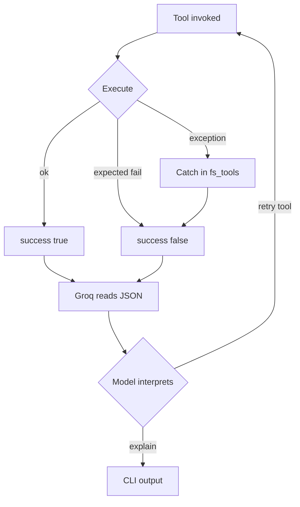

# Architecture — LLM-Powered File System Assistant

This document describes the **detailed system architecture** for the AI Resume / File Assistant. It is derived from [context.md](./context.md) and defines how components interact, what each layer owns, and how data flows from the CLI through Groq to local file operations.

---

## 1. Architectural overview

### 1.1 Purpose

Build a **CLI-driven assistant** that accepts natural language queries about files (primarily resumes in PDF, DOCX, and TXT), uses **Groq** as the reasoning layer via **tool (function) calling**, and executes **deterministic Python tools** for all filesystem and document work.

The LLM never reads disks or writes files directly; it only selects tools and parameters. Python enforces I/O, parsing, and structured responses.

### 1.2 Architectural style

| Aspect | Choice |
| ------ | ------ |
| Pattern | **Agent loop** (ReAct-style): plan → tool call → observe → repeat |
| Integration | **Local tool calling** on Groq (OpenAI-compatible `tools` + `tool_calls`) |
| UI | **Thin CLI** — no web frontend |
| Coupling | **Loose** between orchestration (`llm_file_assistant.py`) and tools (`fs_tools.py`) |
| Tool API | **Uniform JSON dict** with `success` / `error` on every tool |

### 1.3 Quality attributes

| Attribute | How the architecture supports it |
| --------- | -------------------------------- |
| **Safety** | Model cannot execute arbitrary code; only registered tools run |
| **Debuggability** | Tool inputs/outputs are JSON; CLI can log each Groq turn |
| **Consistency** | Single tool response contract for LLM and tests |
| **Latency** | Groq LPU inference; optional smaller model for demos |
| **Simplicity** | Few modules, no database, no message queue |

---

## 2. System context

> **Note:** Standard Markdown previews (including Cursor) do not render Mermaid **C4** diagrams. This doc uses **flowchart** and **sequenceDiagram** only so diagrams render reliably.



**External actors**

- **User** — interacts via terminal.
- **Groq** — hosts the LLM (`llama-3.3-70b-versatile` by default).
- **Local filesystem** — sandboxed under `data/` (resumes, user-created files and folders).

---

## 3. Container diagram (logical modules)



### 3.1 Module responsibilities

| Module | Layer | Responsibility |
| ------ | ----- | ---------------- |
| `llm_file_assistant.py` | Application + presentation | CLI, config load, Groq client, system prompt, tool schemas, agent loop, dispatch, format user-facing output |
| `fs_tools.py` | Domain + infrastructure | `read_file`, `list_files`, `write_file`, `search_in_file`; path validation; parsing; uniform `{ success, error?, ... }` responses |
| `requirements.txt` | Build | `groq`, document libs (`pypdf` / `pdfplumber`, `python-docx`), optional `python-dotenv` |
| `.env` | Config | `GROQ_API_KEY`, optional `GROQ_MODEL` (not committed) |
| `data/` | Data | Sandbox root — resumes and all user read/write paths |
| `data/resumes/` | Data | Seven sample resume files |

---

## 4. Layered architecture

```
┌─────────────────────────────────────────────────────────────┐
│  Presentation        │  CLI: prompt, print, exit commands   │
├─────────────────────────────────────────────────────────────┤
│  Application         │  Agent loop, conversation state      │
│                      │  Tool registry + dispatcher          │
├─────────────────────────────────────────────────────────────┤
│  Integration         │  Groq SDK, retries, model selection  │
├─────────────────────────────────────────────────────────────┤
│  Domain (tools)      │  File operations + search semantics  │
├─────────────────────────────────────────────────────────────┤
│  Infrastructure      │  PDF/DOCX/TXT extraction, os/pathlib │
├─────────────────────────────────────────────────────────────┤
│  Data                │  Local directories (resumes, output) │
└─────────────────────────────────────────────────────────────┘
```

**Dependency rule:** upper layers depend on lower layers; `fs_tools.py` must **not** import Groq. The agent imports both Groq and `fs_tools`.

---

## 5. Core runtime flow

### 5.1 End-to-end sequence



### 5.2 Agent loop (pseudocode)

```text
messages = [system_prompt, ...optional_history..., user_query]

for turn in 1..MAX_TURNS:
    response = groq.chat.completions.create(
        model=GROQ_MODEL,
        messages=messages,
        tools=TOOL_DEFINITIONS,
        tool_choice="auto",
    )
    msg = response.choices[0].message
    messages.append(msg)

    if not msg.tool_calls:
        return msg.content   # done — show in CLI

    for call in msg.tool_calls:
        args = json.loads(call.function.arguments)
        result = TOOL_REGISTRY[call.function.name](**args)
        messages.append({
            "role": "tool",
            "tool_call_id": call.id,
            "content": json.dumps(result),
        })

return "Max tool turns reached; partial state in messages."
```

**Design decisions**

- **MAX_TURNS** (e.g. 10–15) prevents infinite Groq ↔ tool loops on bad prompts.
- Tool results are **JSON strings** in `content` (Groq convention).
- **Parallel tool_calls** (supported on `llama-3.3-70b-versatile`): dispatcher may run multiple tools per turn; order should not be assumed for side-effecting writes.

---

## 6. Component design — `fs_tools.py`

### 6.1 Public tool surface

| Function | Inputs | Success payload | Typical failures |
| -------- | ------ | --------------- | ---------------- |
| `read_file(filepath)` | Path to file | `content`, `metadata` | Not found, unsupported extension, parse error |
| `list_files(directory, extension=None)` | Dir path, optional filter | `files[]` with `name`, `size`, `modified` | Directory not found, not a directory |
| `write_file(filepath, content)` | Path, string body | `message` | Permission denied, parent missing (create or fail — document choice) |
| `search_in_file(filepath, keyword)` | Path, keyword | `matches[]` with `keyword`, `context` | Not found, empty file, parse error |

All return:

```python
{"success": bool, "error": str | omitted, ...payload}
```

### 6.2 Internal structure (recommended)

```text
fs_tools.py
├── _success(**fields) / _failure(error)     # response builders
├── _resolve_path(filepath)                  # normalize, optional sandbox root
├── _metadata(path) -> dict
├── _extract_text(path) -> str               # dispatch by extension
│   ├── _read_pdf(path)
│   ├── _read_docx(path)
│   └── _read_txt(path)
├── read_file(...)
├── list_files(...)
├── write_file(...)
└── search_in_file(...)                      # uses _extract_text + snippet logic
```

### 6.3 Document extraction pipeline



**Search context:** For each match, return a **snippet** around the keyword (e.g. ±80 characters) as `context`, not necessarily the whole document.

### 6.4 Path and security

| Concern | Mitigation |
| ------- | ---------- |
| Path traversal (`../../etc/passwd`) | Resolve paths under `data/` only; reject anything outside sandbox |
| Overwriting system files | All tool I/O confined to `data/` via `_resolve_path` in `fs_tools.py` |
| Large files | Optional max bytes / truncate `content` with notice in metadata |
| Binary non-documents | Reject unknown extensions with clear `error` |

---

## 7. Component design — `llm_file_assistant.py`

### 7.1 Subcomponents

| Subcomponent | Role |
| ------------ | ---- |
| **Config** | Load `GROQ_API_KEY`, `GROQ_MODEL` from env / `.env` |
| **GroqClient** | Thin wrapper around `Groq()` |
| **ToolDefinitions** | List of 4 Groq `tools` entries mirroring `fs_tools` signatures |
| **ToolRegistry** | `dict[str, Callable]` mapping name → function |
| **Agent** | `run(user_query) -> str` implementing the loop |
| **CLI** | `main()`: banner, readline loop, `exit` / `quit` |

### 7.2 System prompt (content guidelines)

The system message should state:

- Role: resume/file assistant with four tools only.
- Always use tools for file access; do not invent file contents.
- Prefer `list_files` before scanning many unknown paths.
- Interpret `success: false` and explain errors to the user.
- Empty `files` or `matches` means “none found,” not a system failure.
- New files and folders go anywhere under `data/` (e.g. `output/summary.txt`).

### 7.3 Groq tool schema mapping

Each Python tool maps to one Groq function tool:

```json
{
  "type": "function",
  "function": {
    "name": "read_file",
    "description": "Read a PDF, DOCX, or TXT file and return text plus metadata.",
    "parameters": {
      "type": "object",
      "properties": {
        "filepath": { "type": "string", "description": "Relative or absolute path" }
      },
      "required": ["filepath"]
    }
  }
}
```

Repeat for `list_files` (`directory`, optional `extension`), `write_file` (`filepath`, `content`), `search_in_file` (`filepath`, `keyword`).

**Registry and schemas must stay in sync** — a single source of truth (e.g. one list of dicts with both `schema` and `handler`) reduces drift.

### 7.4 Conversation state

| Mode | Behavior |
| ---- | -------- |
| **Single-turn (MVP)** | Each CLI line is one fresh `messages` list (system + user only) |
| **Multi-turn (optional)** | Append user/assistant pairs across prompts for follow-ups (“also check priya sharma.docx”) |

For the assignment, single-turn is sufficient; multi-turn is a small extension (keep `messages` in the REPL loop).

---

## 8. Data architecture

### 8.1 Directory layout

```text
project-root/
├── fs_tools.py
├── llm_file_assistant.py
├── requirements.txt
├── .env                    # gitignored
├── .env.example
├── README.md
├── docs/
│   ├── context.md
│   ├── architecture.md
│   ├── implementation-plan.md
│   ├── edgecase.md
│   └── eval.md
├── data/                   # sandbox — all tool paths relative to here
│   ├── resumes/            # seven sample resumes
│   └── ...                 # user-created dirs/files (e.g. output/)
```

### 8.2 Data flows

| Direction | Data | Format |
| --------- | ---- | ------ |
| User → CLI | Query string | Plain text |
| CLI → Groq | Messages + tool defs | API JSON |
| Groq → App | `tool_calls` or text | API JSON |
| App → Tools | Function args | Python kwargs |
| Tools → App | Tool result | `dict` → `json.dumps` |
| App → User | Final natural language | Plain text |

No database, cache, or embedding store in scope.

---

## 9. Configuration architecture

| Variable | Required | Default | Used by |
| -------- | -------- | ------- | ------- |
| `GROQ_API_KEY` | Yes | — | Groq client |
| `GROQ_MODEL` | No | `llama-3.3-70b-versatile` | Agent |
| `DATA_ROOT` | No | `project/data` | Hard-coded sandbox in `fs_tools.py` |
| `MAX_AGENT_TURNS` | No | `12` | Agent loop |

Load order: environment → `.env` (via `python-dotenv` in dev) → defaults.

---

## 10. Error handling strategy



| Layer | Policy |
| ----- | ------ |
| **fs_tools** | Never leak raw stack traces to Groq; return `{ success: false, error: "..." }` |
| **Dispatcher** | Unknown tool name → synthetic failure JSON |
| **Groq API** | Network/auth errors → CLI message; do not crash silently |
| **Agent loop** | Max turns exceeded → user-visible message |

---

## 11. Non-functional concerns

### 11.1 Performance

- Groq calls dominate latency; batch less critical for CLI assignment.
- Cache extracted text per path in-memory within a single query if the model calls `read_file` and `search_in_file` on the same file (optional optimization).

### 11.2 Observability

- Log each turn: model id, tool names, `success` flags (never log API key).
- Optional `DEBUG=1` prints raw tool JSON for grading/demo.

### 11.3 Testing strategy (architecture-level)

| Level | Target |
| ----- | ------ |
| **Unit** | `fs_tools` with temp dirs; PDF/DOCX/TXT fixtures |
| **Integration** | Dispatcher + mocked Groq responses (canned `tool_calls`) |
| **Manual E2E** | CLI + real Groq key; queries from context.md |

`fs_tools` tests require **no** network.

---

## 12. Deployment view

```text
┌──────────────────┐
│ Developer laptop │
│  Python 3.10+    │
│  venv + pip install │
│  .env with key   │
└────────┬─────────┘
         │ HTTPS
         ▼
┌──────────────────┐
│  api.groq.com    │
└──────────────────┘
```

Single-process, local execution. No containers or cloud deploy required for the assignment.

---

## 13. Example scenario — architecture trace

**User:** “Find resumes mentioning Python experience”

| Step | Component | Action |
| ---- | --------- | ------ |
| 1 | CLI | Reads query, calls `Agent.run()` |
| 2 | Agent | Sends system + user message + 4 tool schemas to Groq |
| 3 | Groq | Returns `tool_calls`: `list_files(resumes)` or multiple `search_in_file` |
| 4 | Dispatcher | Runs `list_files("resumes")` → `{ success: true, files: [...] }` |
| 5 | Agent | Appends tool message(s), calls Groq again |
| 6 | Groq | May call `search_in_file` per file with `keyword: "Python"` |
| 7 | fs_tools | Extracts text, finds snippets → `{ success: true, matches: [...] }` |
| 8 | Groq | Returns natural language summary |
| 9 | CLI | Prints “Found matches: …” |

---

## 14. Extension points (future)

| Extension | Touch points |
| --------- | ------------- |
| New file type (e.g. `.md`) | `_extract_text` in `fs_tools` |
| New tool (e.g. `delete_file`) | `fs_tools` + schema + registry |
| Web UI | Replace CLI; reuse `Agent.run()` |
| RAG / embeddings | New service; optional extra tool `semantic_search` |
| Sandboxed cloud deploy | Path policy + env-based roots |

---

## 15. Mapping to development phases

| Phase (context.md) | Architectural deliverable |
| ------------------ | ------------------------- |
| **Phase 1** | `fs_tools.py` complete; tool contract; unit tests |
| **Phase 2** | Tool schemas, registry, Groq agent loop in `llm_file_assistant.py` |
| **Phase 3** | CLI REPL wired to `Agent.run()` |
| **Phase 4** | `data/resumes/` sample data |
| **Phase 5** | README, demo, cross-links to `docs/` |

---

## 16. Architecture decision records (summary)

| ID | Decision | Rationale |
| -- | -------- | --------- |
| ADR-1 | Groq as LLM provider | Fast inference, tool calling, key available |
| ADR-2 | Local tool calling only | Full control over resume I/O; avoid Compound built-in tools |
| ADR-3 | Uniform `{ success, error? }` on all tools | Clear LLM semantics for failure vs empty results |
| ADR-4 | CLI only | Scope, simplicity, assignment fit |
| ADR-5 | Monolith (2 Python modules) | No microservices overhead for demo project |
| ADR-6 | LLM does not touch filesystem | Safety and testability |

---

## 17. Related documentation

- **[context.md](./context.md)** — functional requirements, tool I/O examples, Groq config, CLI samples
- **[implementation-plan.md](./implementation-plan.md)** — phased tasks, acceptance criteria, verification steps
- **[edgecase.md](./edgecase.md)** — boundary conditions and failure modes
- **[eval.md](./eval.md)** — rubric, demo script, sign-off checklist
- **README.md** (to be added) — install, run, environment setup

---

*This architecture aligns with the project goal: an AI-powered assistant that understands natural language and performs file operations through **Groq-guided tool execution** with deterministic Python tools underneath.*
