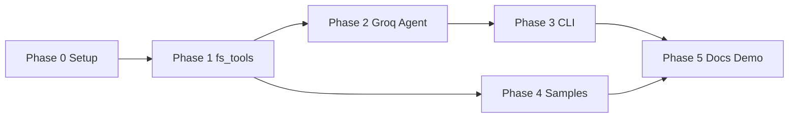

# Implementation Plan — LLM-Powered File System Assistant

This document is a **phase-by-phase build guide** derived from [architecture.md](./architecture.md) and [context.md](./context.md). Follow phases in order; each phase lists tasks, files, acceptance criteria, and verification steps.

---

## Plan overview

| Phase | Name | Primary deliverable | Depends on |
| ----- | ---- | ------------------- | ---------- |
| **0** | Project setup | Repo layout, deps, config | — |
| **1** | File system tools | `fs_tools.py` + unit tests | Phase 0 |
| **2** | Groq agent layer | Tool schemas, registry, agent loop | Phase 1 |
| **3** | CLI | Interactive REPL in `llm_file_assistant.py` | Phase 2 |
| **4** | Sample data | `data/resumes/` fixtures | Phase 1 (minimal); full content here |
| **5** | Documentation & demo | README, demo script/video | Phases 1–4 |



**Architecture layers built per phase**

| Layer | Phase |
| ----- | ----- |
| Data (`data/` sandbox) | 0 (dirs), 4 (files) |
| Domain + infrastructure (`fs_tools.py`) | 1 |
| Integration + application (Groq, agent, dispatcher) | 2 |
| Presentation (CLI) | 3 |
| Docs / demo | 5 |

---

## Phase 0 — Project setup & scaffolding

**Goal:** Runnable Python environment and folder layout matching the architecture. No Groq calls yet.

### 0.1 Tasks

| # | Task | Details |
| - | ---- | ------- |
| 0.1.1 | Create directory structure | `data/`, `data/resumes/`, `docs/` (if missing) |
| 0.1.2 | Add `requirements.txt` | `groq`, `pypdf` (or `pdfplumber`), `python-docx`, `python-dotenv` |
| 0.1.3 | Create virtual environment | `python -m venv .venv`; activate; `pip install -r requirements.txt` |
| 0.1.4 | Add `.gitignore` | `.venv/`, `.env`, `__pycache__/`, `*.pyc`, `.pytest_cache/` |
| 0.1.5 | Add `.env.example` | `GROQ_API_KEY=`, `GROQ_MODEL=llama-3.3-70b-versatile`, optional `MAX_AGENT_TURNS=12` |
| 0.1.6 | Create local `.env` | Copy from example; set real `GROQ_API_KEY` (never commit) |
| 0.1.7 | Stub modules | Empty or minimal `fs_tools.py`, `llm_file_assistant.py` with docstrings |
| 0.1.8 | Add `tests/` package | `tests/__init__.py`, `tests/test_fs_tools.py` (empty tests OK for now) |

### 0.2 Target tree

```text
project-root/
├── fs_tools.py
├── llm_file_assistant.py
├── requirements.txt
├── .env.example
├── .gitignore
├── data/
│   └── resumes/
├── docs/
│   ├── context.md
│   ├── architecture.md
│   ├── implementation-plan.md
│   ├── edgecase.md
│   └── eval.md
└── tests/
    └── test_fs_tools.py
```

### 0.3 Acceptance criteria

- [ ] `pip install -r requirements.txt` succeeds on Python 3.10+
- [ ] `.env` loads `GROQ_API_KEY` via `python-dotenv` in a one-line smoke test
- [ ] `data/` and `data/resumes/` exist at **project root**

### 0.4 Verify

```bash
python -c "from dotenv import load_dotenv; load_dotenv(); import os; assert os.getenv('GROQ_API_KEY')"
```

---

## Phase 1 — File system tools (`fs_tools.py`)

**Goal:** All four tools implemented with the **uniform response contract** (architecture §6). No Groq dependency in this module.

**Maps to:** architecture §6 (Component design — `fs_tools.py`), context.md (Functional Requirements).

### 1.1 Shared foundations (build first)

| # | Task | Implementation notes |
| - | ---- | -------------------- |
| 1.1.1 | `_success(**kwargs)` | Returns `{"success": True, ...}` |
| 1.1.2 | `_failure(error: str)` | Returns `{"success": False, "error": error}` |
| 1.1.3 | `_resolve_path(path)` | Resolve under `DATA_ROOT` (`data/`); reject paths outside sandbox |
| 1.1.4 | `_metadata(path)` | `filename`, human-readable `size`, `extension`, `modified` (ISO date) |
| 1.1.5 | `_extract_text(path)` | Dispatch `.pdf`, `.docx`, `.txt`; else failure |
| 1.1.6 | `_read_pdf` | Use `pypdf` (or `pdfplumber`) |
| 1.1.7 | `_read_docx` | Use `python-docx` (paragraph text) |
| 1.1.8 | `_read_txt` | UTF-8 with clear error on decode failure |
| 1.1.9 | Path policy | All read/write/list/search confined to `data/` |

### 1.2 Tool: `read_file(filepath)`

| # | Task | Acceptance |
| - | ---- | ---------- |
| 1.2.1 | Validate path exists and is a file | Missing → `success: false`, `error: "File not found: ..."` |
| 1.2.2 | Extract full text | Populate `content` |
| 1.2.3 | Attach `metadata` | Per context.md example |
| 1.2.4 | Wrap all exceptions | No uncaught exceptions to caller |

**Manual test:**

```python
read_file("resumes/arjun mehta.pdf")  # after Phase 4 sample exists
```

### 1.3 Tool: `list_files(directory, extension=None)`

| # | Task | Acceptance |
| - | ---- | ---------- |
| 1.3.1 | Validate directory exists | Not found → failure dict |
| 1.3.2 | List files only (not subdirs unless specified later) | Each entry: `name`, `size`, `modified` |
| 1.3.3 | Filter by `extension` | e.g. `.pdf` matches `report.PDF` (case-insensitive) |
| 1.3.4 | Empty directory | `{ "success": true, "files": [] }` |

### 1.4 Tool: `write_file(filepath, content)`

| # | Task | Acceptance |
| - | ---- | ---------- |
| 1.4.1 | Create parent dirs if missing | e.g. `output/summaries/` under `data/` |
| 1.4.2 | Restrict all paths to `data/` | Outside sandbox → `success: false` |
| 1.4.3 | Write UTF-8 text | Success → `message` |
| 1.4.4 | Handle permission errors | Structured failure |

### 1.5 Tool: `search_in_file(filepath, keyword)`

| # | Task | Acceptance |
| - | ---- | ---------- |
| 1.5.1 | Reuse `_extract_text` | Same extensions as `read_file` |
| 1.5.2 | Case-insensitive search (recommended) | Document in README |
| 1.5.3 | Build `matches[]` | Each: `keyword`, `context` (snippet ±80 chars) |
| 1.5.4 | No matches | `{ "success": true, "matches": [] }` |

### 1.6 Unit tests (`tests/test_fs_tools.py`)

| # | Test case |
| - | --------- |
| 1.6.1 | `read_file` on temp `.txt` |
| 1.6.2 | `read_file` missing file → `success: false` |
| 1.6.3 | `list_files` empty dir → `files: []` |
| 1.6.4 | `list_files` with extension filter |
| 1.6.5 | `write_file` creates file under temp dir inside `data/` |
| 1.6.6 | `search_in_file` finds keyword + snippet |
| 1.6.7 | `search_in_file` no match → empty `matches` |
| 1.6.8 | Unsupported extension → failure |

Use `pytest` + `tmp_path` fixture; no network.

### 1.7 Phase 1 deliverables

| File | Status |
| ---- | ------ |
| `fs_tools.py` | Done — 4 public tools + sandbox helpers |
| `tests/test_fs_tools.py` | Done — 12 tests (8 required + extras) |

### 1.8 Acceptance criteria

- [x] Every tool returns `success` on every code path
- [x] Failures include `error` string; no stack traces in return value
- [x] `fs_tools.py` does **not** import `groq`
- [ ] `pytest tests/test_fs_tools.py` passes — run locally: `pip install -r requirements.txt` then `pytest tests/test_fs_tools.py -v`

### 1.9 Optional early sample (unblocks testing before Phase 4)

Create one file: `resumes/sample.txt` with known text for manual checks.

---

## Phase 2 — Groq agent layer (`llm_file_assistant.py` core)

**Goal:** Tool definitions, registry, dispatcher, and agent loop per architecture §5–§7. **No full CLI yet** — test via `if __name__ == "__main__"` or a small script.

**Maps to:** architecture §5.2 (agent loop), §7 (component design), §9 (config).

### 2.1 Configuration module

| # | Task | Details |
| - | ---- | ------- |
| 2.1.1 | `load_config()` | `GROQ_API_KEY` (required), `GROQ_MODEL` (default `llama-3.3-70b-versatile`) |
| 2.1.2 | `MAX_AGENT_TURNS` | Default `12` from env |
| 2.1.3 | Fail fast | Clear error if API key missing |

### 2.2 Tool schemas (single source of truth)

| # | Task | Details |
| - | ---- | ------- |
| 2.2.1 | Define `TOOLS` list | Each entry: `schema` (Groq JSON) + `handler` (callable) |
| 2.2.2 | `read_file` schema | `filepath` required |
| 2.2.3 | `list_files` schema | `directory` required; `extension` optional |
| 2.2.4 | `write_file` schema | `filepath`, `content` required |
| 2.2.5 | `search_in_file` schema | `filepath`, `keyword` required |
| 2.2.6 | Export `TOOL_DEFINITIONS` | List passed to Groq API |
| 2.2.7 | Build `TOOL_REGISTRY` | `name -> handler` from same list |

### 2.3 System prompt

| # | Task | Content (architecture §7.2) |
| - | ---- | ----------------------------- |
| 2.3.1 | Role | Resume/file assistant; four tools only |
| 2.3.2 | Rules | Use tools for file access; do not invent contents |
| 2.3.3 | Strategy | Prefer `list_files` before many reads |
| 2.3.4 | Errors | Explain `success: false`; empty lists = no results |
| 2.3.5 | Writes | Default to paths under `data/` (e.g. `output/summary.txt`) |

### 2.4 Dispatcher

| # | Task | Details |
| - | ---- | ------- |
| 2.4.1 | `dispatch_tool(name, arguments_json)` | `json.loads` → call handler `**kwargs` |
| 2.4.2 | Unknown tool name | Return `{"success": false, "error": "Unknown tool: ..."}` |
| 2.4.3 | Invalid JSON args | Return structured failure |
| 2.4.4 | Return `json.dumps(result)` | For Groq `role: tool` message |

### 2.5 Agent loop

| # | Task | Details |
| - | ---- | ------- |
| 2.5.1 | `run_agent(client, user_query) -> str` | Implement architecture §5.2 pseudocode |
| 2.5.2 | Message list | `[system, user]` for MVP single-turn |
| 2.5.3 | Groq call | `chat.completions.create(..., tools=..., tool_choice="auto")` |
| 2.5.4 | Handle `tool_calls` | Loop each call; append assistant + tool messages |
| 2.5.5 | Termination | Return `message.content` when no `tool_calls` |
| 2.5.6 | Max turns guard | User-visible message when exceeded |
| 2.5.7 | Groq API errors | Catch; return friendly string (auth, rate limit, network) |

### 2.6 Debug / observability

| # | Task | Details |
| - | ---- | ------- |
| 2.6.1 | `DEBUG=1` | Log turn number, tool names, `success` from results (never log API key) |

### 2.7 Integration tests (optional but recommended)

| # | Test | Approach |
| - | ---- | -------- |
| 2.7.1 | Dispatcher | Call `dispatch_tool` with known JSON; assert dict |
| 2.7.2 | Agent (live) | One query with real API key: `"List files in resumes"` |
| 2.7.3 | Agent (mock) | Patch `client.chat.completions.create` with canned `tool_calls` |

### 2.8 Phase 2 deliverables

| Component | Location |
| --------- | -------- |
| Config + Groq client | `llm_file_assistant.py` |
| `TOOLS`, registry, dispatcher | `llm_file_assistant.py` |
| `run_agent()` | `llm_file_assistant.py` |
| Smoke entrypoint | `python llm_file_assistant.py --query "..."` (temporary flag OK) |

### 2.9 Acceptance criteria

- [ ] Groq returns `tool_calls` for `"List files in the resumes folder"` (with samples present)
- [ ] Tool results appear as `role: tool` messages in the next request
- [ ] Final response is natural language (not raw JSON only)
- [ ] Unknown tool / bad path surfaced to user via model or guard messages
- [ ] `MAX_TURNS` prevents infinite loops

### 2.10 Verify (manual)

```bash
python -c "from llm_file_assistant import run_agent, get_client; print(run_agent(get_client(), 'List files in resumes'))"
```

(Adjust to actual function names you implement.)

---

## Phase 3 — CLI (presentation layer)

**Goal:** Interactive REPL wired to `run_agent()` per architecture §7.1 and context.md CLI examples.

**Maps to:** architecture layer “Presentation”, context.md “Expected CLI Interaction”.

### 3.1 Tasks

| # | Task | Details |
| - | ---- | ------- |
| 3.1.1 | `main()` entrypoint | `if __name__ == "__main__"` |
| 3.1.2 | Startup banner | `AI Resume Assistant Started` / `Enter your query:` |
| 3.1.3 | REPL loop | Read input until `exit`, `quit`, or EOF |
| 3.1.4 | Invoke agent | Pass user line to `run_agent()` |
| 3.1.5 | Print response | Blank line before/after for readability |
| 3.1.6 | Keyboard interrupt | Graceful `Ctrl+C` message |
| 3.1.7 | Empty input | Skip or reprompt |
| 3.1.8 | Remove Phase 2 temp flags | Single entry: `python llm_file_assistant.py` |

### 3.2 Single-turn vs multi-turn

| Mode | Phase 3 scope | Implementation |
| ---- | ------------- | -------------- |
| **MVP** | Required | New `messages` per query (system + user only) |
| **Extension** | Optional | Persist `messages` across REPL iterations |

### 3.3 CLI test scenarios (from context.md)

| User input | Expected behavior |
| ---------- | ------------------- |
| `Read all resumes in resumes folder` | Lists or reads files; summarizes |
| `Find resumes mentioning Python` | Uses search/list; shows contexts |
| `Write a summary to output/summary.txt` | `write_file` under `data/` |
| Invalid path | Explains error without crashing |

### 3.4 Acceptance criteria

- [ ] `python llm_file_assistant.py` starts REPL
- [ ] `exit` / `quit` ends program
- [ ] All four tools reachable via natural language
- [ ] No uncaught exceptions on typical user typos (agent or CLI handles)

---

## Phase 4 — Sample data & fixtures

**Goal:** Realistic `data/resumes/` content; users create other folders under `data/` as needed.

**Note:** Minimal `resumes/sample.txt` may exist from Phase 1; this phase completes the full dataset.

### 4.1 Tasks

| # | Task | Details |
| - | ---- | ------- |
| 4.1.1 | Seven resumes in `data/resumes/` | See `data/resumes/README.md` |
| 4.1.2 | Format split | 3 PDF, 2 DOCX, 2 TXT (all formats represented) |
| 4.1.3 | `data/README.md` | Explains sandbox and path rules |
| 4.1.4 | Verify extractors | Each file readable via `read_file` |

### 4.2 Sample roster (7 files)

| File | Format | Demo search hooks |
| ---- | ------ | ----------------- |
| `arjun mehta.pdf` | PDF | Python |
| `priya sharma.docx` | DOCX | Python, automation |
| `rahul verma.txt` | TXT | Agile, Scrum (no Python) |
| `ananya reddy.pdf` | PDF | Java, Spring Boot |
| `kavya nair.docx` | DOCX | React, frontend |
| `rohan patel.txt` | TXT | Python, machine learning |
| `sneha iyer.pdf` | PDF | DevOps, Docker, Kubernetes |

### 4.3 Acceptance criteria

- [ ] `list_files("resumes")` returns seven files
- [ ] `search_in_file(..., "Python")` hits arjun, priya, and rohan; not rahul
- [ ] `write_file("output/summaries/demo.txt", "...")` succeeds (path under `data/`)

---

## Phase 5 — Documentation, polish & demo

**Goal:** Someone else can clone, configure, run, and evaluate the project.

### 5.1 README.md

| Section | Content |
| ------- | ------- |
| Overview | One paragraph + link to docs |
| Prerequisites | Python 3.10+, Groq API key |
| Setup | venv, `pip install`, `.env` |
| Run | `python llm_file_assistant.py` |
| Project structure | Tree with `data/` sandbox |
| Example queries | From context.md |
| Env vars | `GROQ_API_KEY`, `GROQ_MODEL`, `MAX_AGENT_TURNS`, `DEBUG` |
| Testing | `pytest` command |

### 5.2 Documentation cross-links

| File | Update |
| ---- | ------ |
| `docs/context.md` | Link to `implementation-plan.md` |
| `docs/architecture.md` | Link to `implementation-plan.md` in §17 |
| `docs/implementation-plan.md` | Already references architecture + context |

### 5.3 Demo deliverables

| # | Task | Details |
| - | ---- | ------- |
| 5.3.1 | Example queries in README | 5–8 prompts (list, search, write) |
| 5.3.2 | Demo video / recording (optional) | Walk through: list → search → write summary |
| 5.3.3 | `.env.example` | Final review — no secrets |

### 5.4 Quality pass

| # | Check |
| - | ----- |
| 5.4.1 | Run full `pytest` |
| 5.4.2 | Run CLI E2E with example queries from README |
| 5.4.3 | Confirm `.gitignore` excludes `.env` |
| 5.4.4 | Pin dependency versions in `requirements.txt` (optional `==`) |

### 5.5 Acceptance criteria

- [ ] README allows setup without reading all of `docs/`
- [ ] Demo scenarios pass end-to-end with Groq key
- [ ] All docs in `docs/` linked from README

---

## Master checklist (definition of done)

Use this before submission or demo recording.

### Code

- [ ] `fs_tools.py` — 4 tools, uniform `{ success, error? }`
- [ ] `llm_file_assistant.py` — config, schemas, registry, agent loop, CLI
- [ ] `requirements.txt` — complete
- [ ] `.env.example` — present; `.env` gitignored

### Data

- [ ] `data/resumes/` with all seven sample files (see `data/resumes/README.md`)
- [ ] `write_file` can create folders/files anywhere under `data/`

### Tests

- [ ] `pytest` passes (fs_tools unit tests minimum)

### Docs

- [ ] `README.md`
- [ ] `docs/context.md`, `architecture.md`, `implementation-plan.md`, `edgecase.md`, `eval.md`

### E2E (manual)

- [ ] “Find resumes mentioning Python” returns sensible answer
- [ ] “Read all resumes in resumes folder” works
- [ ] Write under `data/` works (e.g. `output/summary.txt`)

---

## Risk register & mitigations

| Risk | Phase | Mitigation |
| ---- | ----- | ---------- |
| PDF text extraction empty/garbled | 1 | Test with real resume PDF; try `pdfplumber` if `pypdf` fails |
| Groq tool call JSON invalid | 2 | Dispatcher try/except; return failure dict |
| Infinite tool loop | 2 | `MAX_AGENT_TURNS` |
| Path traversal | 1 | `_resolve_path` — all I/O under `data/` only |
| API key leak | 0, 5 | `.gitignore`, never log key |
| Model chooses wrong file | 2, 3 | System prompt: use `list_files` first |
| Rate limits / network | 2 | User-friendly error in agent |

---

## Suggested timeline (indicative)

| Phase | Effort (solo, approximate) |
| ----- | -------------------------- |
| 0 | 0.5–1 hour |
| 1 | 4–8 hours |
| 2 | 3–6 hours |
| 3 | 1–2 hours |
| 4 | 1–2 hours |
| 5 | 2–4 hours |
| **Total** | **~12–23 hours** |

Adjust if pairing, reusing libraries, or skipping optional tests.

---

## Related documentation

- **[architecture.md](./architecture.md)** — components, flows, ADRs
- **[context.md](./context.md)** — requirements, tool I/O examples, Groq config
- **[edgecase.md](./edgecase.md)** — edge cases and QA scenarios
- **[eval.md](./eval.md)** — evaluation rubric and demo script

---

*Implementation order follows architecture §15: tools first, then Groq agent, then CLI, then samples and documentation.*
